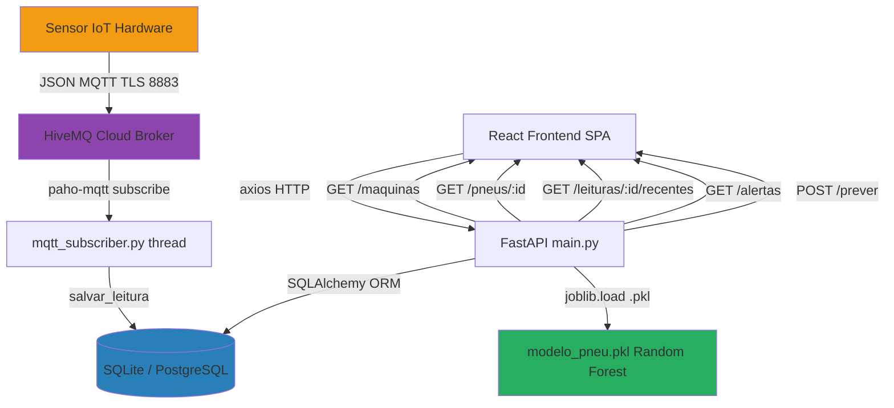

# AUDITORIA TÉCNICA — TirePredict
**Auditor:** Staff+ Principal Engineer / Software Architect  
**Data:** 2026-09-17  
**Versão Auditada:** Repositório completo (backend Python + frontend React)  
**Modo:** AUDIT_ONLY — nenhuma alteração de código foi feita

---

## 1. EXECUTIVE SUMMARY

O TirePredict é um projeto acadêmico (TCC) funcional e bem intencionado. Implementa corretamente os conceitos que se propõe a demonstrar: coleta IoT via MQTT, API REST com FastAPI, persistência com SQLAlchemy, predição por Machine Learning e dashboard React em tempo real.

**Para um TCC em estágio final, o projeto está num nível competente acima da média.** A arquitetura é coerente, o código é legível e há boas práticas presentes que muitos projetos profissionais não têm.

Entretanto, existem **problemas críticos que precisam ser resolvidos antes de qualquer apresentação ou uso em campo real**, principalmente:

1. **Credenciais reais expostas no `.env` versionado** (senha MQTT em texto claro no repositório)
2. **O modelo ML carrega em tempo de importação** — falha no import mata toda a API
3. **Banco de dados efêmero em produção** (SQLite em container Railway sem volume)
4. **Classificação de risco no frontend inconsistente com o backend ML**
5. **Zero testes automatizados** em qualquer camada

**Risco atual para apresentação:** Médio-alto. O sistema funciona localmente mas a produção está vazia e frágil.

---

## 2. PROJECT DISCOVERY

### O que este projeto é

Sistema de Monitoramento de Pneus de Máquinas Agrícolas (TPMS — Tire Pressure Monitoring System) com predição de risco por Machine Learning. Desenvolvido como Trabalho de Conclusão de Curso (TCC) pela equipe "Nodus".

### Qual problema ele resolve

Previne falhas mecânicas em máquinas agrícolas (tratores, colheitadeiras) causadas por pneus com pressão ou temperatura fora do normal. O sistema alerta o operador antes da falha ocorrer.

### Quem utiliza

- **Operadores de campo:** veem o dashboard e os alertas
- **Sensores IoT:** publicam dados via MQTT (hardware não analisado, só o subscriber)
- **Professores/banca do TCC:** avaliam o sistema

### Stack Identificada

| Camada | Tecnologia |
|---|---|
| Backend | Python 3.x + FastAPI 0.141 + Uvicorn |
| ORM | SQLAlchemy 2.0 |
| DB Local | SQLite (arquivo `tirepredict.db`) |
| DB Produção | PostgreSQL (Railway) — com fallback SQLite |
| ML | scikit-learn 1.9 (Random Forest, inferido do .pkl) + joblib + numpy |
| IoT | MQTT via Paho 2.1 → HiveMQ Cloud (TLS 8883) |
| Validação | Pydantic v2 |
| Frontend | React 19 + Vite 8 + React Router 7 |
| HTTP Client | Axios 1.x |
| Gráficos | Recharts 3 |
| Linting | oxlint |
| Deploy | Railway (backend) + local dev (frontend) |

### Arquitetura Identificada

Monolítico backend (não microsserviços). Dois sub-sistemas separados:
- `backend/` → Python FastAPI com MQTT subscriber em thread de background
- `frontend/` → SPA React servida pelo Vite, consome a API

### Fluxo Principal Identificado

```
Sensor IoT → MQTT/HiveMQ → mqtt_subscriber.py → salvar_leitura() → SQLAlchemy → BD
Frontend → listarFrota() [axios] → GET /maquinas + GET /pneus/{id} + GET /leituras/{id}/recentes → FastAPI → BD
Operador → POST /prever → predicao.py → modelo_pneu.pkl → resposta JSON
```

### Nível de Maturidade Estimado

**Protótipo funcional / MVP acadêmico** — nível 2-3/10 na escala de maturidade de produção. Funcional para demonstração, insuficiente para campo real.

### O que não foi possível determinar

- O modelo `.pkl` não foi inspecionado internamente (binário serializado)
- Não há acesso ao banco de produção da Railway
- Não há código de treinamento do modelo no repositório (apenas o artefato `.pkl`)
- Não há hardware de sensor para validar o protocolo MQTT end-to-end

---

## 3. DETECTED TECHNOLOGY STACK

```
Backend:
  fastapi==0.141.1
  uvicorn==0.52.1
  SQLAlchemy==2.0.51
  psycopg2-binary==2.9.12
  pydantic==2.13.4
  python-dotenv==1.2.2
  paho-mqtt==2.1.0
  joblib==1.5.3
  numpy==2.5.1
  scikit-learn==1.9.0
  scipy==1.18.0

Frontend:
  react@19.2.8
  react-dom@19.2.8
  react-router-dom@7.18.2
  recharts@3.10.1
  axios@1.19.0
  vite@8.2.0
  @vitejs/plugin-react@6.0.4
  oxlint@1.75.0
```

> [!NOTE] Todas as dependências são versões recentes e não há versões abandonadas ou conhecidamente vulneráveis identificadas nesta auditoria estática. Nenhuma varredura CVE foi executada.

---

## 4. REPOSITORY STRUCTURE

```
tirepredict/                          ← raiz do repositório
├── .env                              ← ⚠️ CREDENCIAIS REAIS — não deve existir no git
├── .env.example                      ← ✅ template de ambiente correto
├── .gitignore                        ← parcialmente correto (ver problema abaixo)
├── railway.toml                      ← configuração de deploy
├── requirements.txt                  ← dependências Python sem lockfile
├── tirepredict.db                    ← banco SQLite local (ignorado pelo .gitignore)
├── README.md                         ← documentação operacional boa
├── DOCUMENTACAO_COMPLETA.md          ← documentação de contexto
├── package-lock.json                 ← ⚠️ arquivo na raiz sem propósito claro
│
├── backend/                          ← módulo Python
│   ├── main.py                       ← FastAPI app + rotas + lifespan
│   ├── database.py                   ← configuração SQLAlchemy + helper salvar_leitura
│   ├── models.py                     ← entidades ORM (Maquina, Pneu, Leitura)
│   ├── mqtt_subscriber.py            ← subscriber MQTT com thread de background
│   ├── predicao.py                   ← carregamento e inferência do modelo ML
│   ├── seed.py                       ← dados iniciais
│   ├── modelo_pneu.pkl               ← modelo serializado (550 KB)
│   └── tirepredict.db                ← ⚠️ segundo arquivo .db dentro do backend
│
└── frontend/                         ← aplicação React/Vite
    ├── index.html                    ← entrada HTML
    ├── vite.config.js                ← configuração Vite mínima
    ├── package.json                  ← dependências
    ├── .oxlintrc.json                ← configuração de lint
    └── src/
        ├── main.jsx                  ← entrada React
        ├── App.jsx                   ← roteamento principal
        ├── index.css                 ← design tokens globais + temas
        ├── App.css                   ← estilos adicionais
        ├── components/               ← componentes reutilizáveis
        │   ├── CardPneu.jsx          ← card de pneu com badge de risco
        │   ├── CardAlerta.jsx        ← card de alerta de pneu
        │   ├── GraficoPressao.jsx    ← gráfico de área (Recharts)
        │   ├── PainelAlertas.jsx     ← painel resumo de alertas
        │   ├── Sidebar.jsx           ← navegação lateral
        │   ├── StatCard.jsx          ← card de estatística simples
        │   ├── ThemeToggle.jsx       ← alternância dark/light
        │   └── Topbar.jsx            ← barra superior com status MQTT
        ├── pages/                    ← páginas roteadas
        │   ├── Dashboard.jsx         ← painel de pneus por máquina
        │   ├── Frota.jsx             ← lista de máquinas
        │   ├── Alertas.jsx           ← alertas por máquina
        │   └── Dashboard.css         ← estilos compartilhados entre páginas
        └── services/
            ├── api.js                ← cliente Axios + funções de negócio
            └── mockData.js           ← dados mock (não usados em produção)
```

**Observações estruturais:**
- Existe `tirepredict.db` na raiz E dentro de `backend/` — dois bancos SQLite locais
- `frontend/node_modules/` e `frontend/dist/` não estão no `.gitignore` (o gitignore atual tem `tirepredict-dashboard/` — nome desatualizado que não corresponde ao diretório real `frontend/`)
- `mockData.js` existe mas aparenta não estar conectado ao fluxo real
- `package-lock.json` na raiz do projeto sem `package.json` correspondente

---

## 5. ARCHITECTURE REVERSE ENGINEERING

### Visão Geral



### Camadas e Responsabilidades

| Módulo | Responsabilidade |
|---|---|
| `main.py` | Orquestração: define rotas, faz DI via `Depends`, valida entrada com Pydantic, chama `salvar_leitura` e `prever_risco` |
| `database.py` | Infraestrutura: configura engine SQLAlchemy, sessão, URL do banco, e contém `salvar_leitura` (lógica de negócio aqui — ver problema abaixo) |
| `models.py` | Domínio: entidades ORM com constraints e índices |
| `mqtt_subscriber.py` | Adaptador IoT: valida payload Pydantic, chama `salvar_leitura` |
| `predicao.py` | ML: carrega modelo e executa inferência |
| `seed.py` | DevOps/setup: cria dados iniciais idempotente |
| `api.js` | Adaptador API + transformação de dados de domínio |
| `pages/` | Páginas com polling próprio (sem estado global) |
| `components/` | UI pura, recebe props |

### Ciclo de Vida de uma Requisição

```
GET /pneus/{maquina_id}:
  1. FastAPI valida parâmetro de path (int)
  2. Injeta sessão de banco via Depends(get_db)
  3. db.get(Maquina, maquina_id) → 404 se não existir
  4. db.query(Pneu).filter().order_by() → lista
  5. Serializa manualmente para dict
  6. Retorna JSON com status 200
  7. Sessão fechada no finally do get_db
```

### Pontos Fortes Arquiteturais

- **Separação clara:** modelos separados de rotas separados de infra
- **Lifespan correto:** `@asynccontextmanager lifespan` para startup/shutdown da thread MQTT
- **Dual-mode import:** padrão `try/except ImportError` permite executar tanto como módulo (`python -m backend.main`) quanto direto (`python main.py`)
- **Pool de conexão configurável:** `DB_POOL_SIZE`, `DB_MAX_OVERFLOW`, `DB_POOL_RECYCLE` via env vars
- **TLS no MQTT:** porta 8883 com `ssl.CERT_REQUIRED` — sem comunicação em plaintext
- **Reconexão automática:** `reconnect_delay_set(min_delay=1, max_delay=60)`
- **Índices de banco:** `ix_leituras_pneu_timestamp` e `ix_pneus_maquina_id` corretos

### Fraquezas Arquiteturais

1. **`salvar_leitura` em `database.py`:** lógica de negócio (validar se pneu existe, criar leitura) está misturada com configuração de infraestrutura de banco. Viola separação de responsabilidades.
2. **Singleton global `subscriber = MQTTSubscriber()`:** instanciado no import do módulo, dificulta testes
3. **`modelo = joblib.load(MODELO_PATH)` no módulo `predicao.py`:** executado no import, não no lifespan. Se o `.pkl` não existir, a aplicação inteira falha ao importar
4. **Sem camada de repository/service:** as rotas em `main.py` fazem queries SQLAlchemy diretamente, sem abstração
5. **Frontend sem gerenciamento de estado global:** cada página faz polling independente; `/frota` e `/dashboard` podem fazer chamadas duplicadas simultâneas à mesma API
6. **`api.js` mistura duas responsabilidades:** é adaptador HTTP e também contém lógica de transformação de domínio (`classificarRisco`, `listarFrota` que agrega dados de múltiplas chamadas)

### Riscos Arquiteturais

| Risco | Evidência | Severidade |
|---|---|---|
| Modelo ML carrega no import, não no lifespan | `predicao.py` linha 9: `modelo = joblib.load(...)` | Alto |
| SQLite em container Railway sem volume persistente | README seção 9, `railway.toml` sem volume | Alto |
| Credenciais em plaintext no repositório | `.env` versionado com senha real | Crítico |
| N+1 queries no frontend | `listarFrota()` chama 1 + N + N*M endpoints | Médio |
| Sem autenticação nas rotas públicas | Qualquer um pode inserir leituras via POST /leituras | Médio |

---

## 6. MAIN APPLICATION FLOWS

### Fluxo 1: Coleta IoT via MQTT

```
Entry:    HiveMQ Cloud → tcc/tpms/pneu1
Receive:  _on_message() → json.loads() → MensagemSensor.model_validate()
Validate: Pydantic field_validators (pneu_id > 0, 0 ≤ pressao ≤ 250, -80 ≤ temp ≤ 200)
Persist:  salvar_leitura(dados) → verifica pneu existe → Leitura(**dados) → commit
Error:    ValidationError, ValueError, Exception → log.warning/exception, last_error atualizado
Observe:  last_message_at e last_error expostos via /health
```

**Gaps:** Se o banco estiver indisponível durante o `_on_message`, a mensagem MQTT é descartada silenciosamente (sem fila, sem retry de persistência).

### Fluxo 2: Dashboard em Tempo Real (Frontend)

```
Entry:    useEffect → [Frota.jsx | Dashboard.jsx] monta
Fetch:    listarFrota() = GET /maquinas → para cada máquina: GET /pneus/:id → para cada pneu: GET /leituras/:id/recentes
Process:  classificarRisco(pressao) em api.js (lógica CLIENT-SIDE, diferente do modelo ML)
Render:   CardPneu, GraficoPressao, PainelAlertas
Poll:     setInterval(carregar, 5000) a cada 5 segundos
Cleanup:  clearInterval na desmontagem (correto — sem memory leak)
```

**Gap crítico:** A classificação de risco que aparece nos cards de pneu é calculada no frontend (pressao < 25 = ALTO, pressao < 30 = MEDIO) e **não usa o modelo ML**. O endpoint `/prever` existe mas não é chamado pelo dashboard.

### Fluxo 3: Predição Manual

```
Entry:  POST /prever {pneu_id, pressao, temperatura, horas_uso}
Validate: PrevisaoInput Pydantic
Process:  prever_risco(pressao, temperatura, horas_uso)
ML:       modelo.predict() + modelo.predict_proba()
Response: {nivel, probabilidade, acao_recomendada}
```

**Gap:** `pneu_id` é recebido mas completamente ignorado na predição. Horas de uso não são persistidas em lugar nenhum.

---

## 7. CRITICAL FINDINGS

> [!CAUTION] Estes problemas podem comprometer a apresentação, a segurança ou a integridade dos dados.

| ID | Severidade | Problema | Localização |
|---|---|---|---|
| F-01 | 🔴 P0 | Credencial MQTT real no `.env` versionado | `.env` linha 4 |
| F-02 | 🔴 P1 | Modelo ML carrega no import — falha total da API | `predicao.py` linha 9 |
| F-03 | 🔴 P1 | SQLite efêmero em produção (Railway) | `railway.toml`, README seção 9 |
| F-04 | 🟠 P2 | Classificação de risco divergente entre backend e frontend | `api.js` linha 18-23 vs ML |
| F-05 | 🟠 P2 | N+1 requests em `listarFrota()` | `api.js` linha 41-76 |
| F-06 | 🟠 P2 | Rotas de leitura sem autenticação | `main.py` linha 108-113 |
| F-07 | 🟡 P3 | `salvar_leitura` em `database.py` (responsabilidade errada) | `database.py` linha 39-59 |
| F-08 | 🟡 P3 | `pneu_id` aceito em `/prever` mas ignorado | `main.py` linha 116-118 |
| F-09 | 🟡 P3 | `.gitignore` com path desatualizado (`tirepredict-dashboard/`) | `.gitignore` linha 14-15 |
| F-10 | 🟡 P3 | Código de treinamento do modelo ausente no repositório | — |
| F-11 | 🟡 P3 | Dois arquivos `tirepredict.db` (raiz e `backend/`) | estrutura |
| F-12 | 🟡 P4 | `mockData.js` importado em nenhum lugar | `services/mockData.js` |
| F-13 | 🟡 P4 | `Alertas.jsx` silencia erros com `.catch(() => {})` | `Alertas.jsx` linha 23 |
| F-14 | 🟡 P4 | `GraficoPressao` diz "IA" na tendência, mas é aritmética simples | `GraficoPressao.jsx` linha 17 |
| F-15 | 🟡 P4 | `package-lock.json` na raiz sem `package.json` | raiz |

---

## 8. SECURITY AUDIT

### F-01 — CRÍTICO: Credenciais Expostas no Repositório

**Evidência confirmada:**
```
.env linha 4: MQTT_PASSWORD=Bangchan143<3*
```

O arquivo `.env` está versionado no Git com senha real. Qualquer pessoa com acesso ao repositório pode:
- Conectar-se ao broker HiveMQ com as credenciais do time
- Publicar mensagens falsas no tópico `tcc/tpms/pneu1`
- Injetar leituras de pressão/temperatura fabricadas no banco de produção

**O `.gitignore` tem `.env` listado, portanto este arquivo foi adicionado intencionalmente ou antes da regra ser criada. O dano já está feito se o repositório tiver algum commit público.**

**Ação imediata:** Rotacionar a senha MQTT no HiveMQ Cloud, depois remover o `.env` do histórico do Git com `git filter-repo` ou `BFG Repo Cleaner`.

### Autenticação e Autorização

| Endpoint | Autenticação | Risco |
|---|---|---|
| `GET /maquinas` | Nenhuma | Baixo (somente leitura) |
| `GET /pneus/:id` | Nenhuma | Baixo (somente leitura) |
| `GET /leituras/:id/recentes` | Nenhuma | Baixo (somente leitura) |
| `GET /alertas` | Nenhuma | Baixo (somente leitura) |
| `POST /leituras` | Nenhuma | **Médio** — qualquer um pode inserir leituras falsas |
| `POST /prever` | Nenhuma | Baixo (sem efeito colateral) |
| `POST /admin/seed` | `X-Admin-Token` com `hmac.compare_digest` | ✅ Correto |

**Avaliação:** Para um TCC, a ausência de auth nas rotas públicas é aceitável. O `admin/seed` está protegido corretamente com `hmac.compare_digest` (resistente a timing attack). O único risco relevante é POST /leituras sem auth — porém para apresentação acadêmica, não é bloqueador.

### CORS

```python
origins = [origin.strip() for origin in os.getenv("CORS_ORIGINS", "http://localhost:5173").split(",")]
allow_methods=["GET", "POST"]  # ✅ Restrito
allow_headers=["Content-Type", "X-Admin-Token"]  # ✅ Restrito
```

CORS configurado corretamente. Não usa `allow_origins=["*"]`.

### Validação de Entrada

- Pydantic v2 valida todos os inputs nas rotas FastAPI ✅
- `MensagemSensor` valida payload MQTT antes de persistir ✅
- CheckConstraints no banco reforçam no nível de BD ✅
- `hmac.compare_digest` no admin token ✅

### Injeção SQL

Impossível via ORM com parâmetros bindados pelo SQLAlchemy. ✅

### Gerenciamento de Segredos

- `ADMIN_SEED_TOKEN` corretamente lido do ambiente ✅
- `MQTT_PASSWORD` exposto no `.env` versionado ❌ (F-01)
- Sem secrets no código Python ✅

---

## 9. DATA / DATABASE AUDIT

### Schema

```sql
maquinas (id PK, nome VARCHAR(120) NOT NULL, modelo VARCHAR(120) NOT NULL)
pneus (id PK, maquina_id FK→maquinas.id CASCADE, posicao VARCHAR(64) NOT NULL)
         INDEX: ix_pneus_maquina_id
leituras (id PK, pneu_id FK→pneus.id CASCADE, pressao FLOAT NOT NULL, temperatura FLOAT NOT NULL,
          timestamp DATETIME(timezone=True) NOT NULL DEFAULT=now(UTC))
          CHECK: pressao >= 0, temperatura >= -80
          INDEX: ix_leituras_pneu_timestamp (pneu_id, timestamp)
```

**Avaliação positiva:**
- Índice composto `(pneu_id, timestamp)` na tabela `leituras` está correto para a query mais crítica (`ORDER BY timestamp DESC LIMIT 100`) ✅
- FK com `ON DELETE CASCADE` — deleção de máquina limpa pneus e leituras ✅
- `timezone=True` no timestamp com `default=lambda: datetime.now(timezone.utc)` — correto ✅
- CheckConstraints reforçam invariantes do domínio ✅

**Problemas:**

| Problema | Impacto |
|---|---|
| Não há `UNIQUE(maquina_id, posicao)` em `pneus` | Pode criar dois pneus na mesma posição da mesma máquina |
| `pressao FLOAT` e `temperatura FLOAT` — sem limites superiores no banco | CheckConstraint só tem limite inferior; valores absurdos podem entrar se a validação Pydantic falhar |
| Sem soft delete / audit trail | Leituras deletadas somem sem rastreio |
| `horas_uso` não é persistida | Campo central do modelo ML não tem histórico |

### Migrations

**Não existem.** O schema é criado com `Base.metadata.create_all()` que não suporta alterações de schema. Se um campo precisar ser adicionado, será necessário intervenção manual no banco.

Para um TCC, isso é aceitável. Para produção real, seria necessário Alembic.

### SQLite vs PostgreSQL

O código detecta corretamente o banco e ajusta `connect_args` e pool options. O fallback para SQLite em produção é o principal risco operacional identificado (F-03).

---

## 10. API / CONTRACT AUDIT

### Análise das Rotas

| Rota | Paginação | Validação | Erro | Observação |
|---|---|---|---|---|
| `GET /maquinas` | ❌ Não tem | N/A | N/A | OK para volume pequeno |
| `GET /pneus/:id` | ❌ Não tem | 404 se máquina não existe | ✅ | OK |
| `GET /leituras/:id/recentes` | Hardcoded LIMIT 100 | 404 se pneu não existe | ✅ | Funcional, não flexível |
| `GET /alertas` | Hardcoded LIMIT 50 | N/A | N/A | Filtro `pressao < 30` hardcoded |
| `POST /leituras` | N/A | Pydantic + 404 | ✅ | 201 correto |
| `POST /prever` | N/A | Pydantic | ✅ | Ignora pneu_id (F-08) |
| `POST /admin/seed` | N/A | Token HMAC | ✅ | Bem implementado |

### Serialização Manual

```python
def leitura_dict(leitura: Leitura):
    return {"id": ..., "pneu_id": ..., "pressao": ..., "temperatura": ..., "timestamp": ...}
```

Serialização manual em vez de schemas Pydantic de resposta. Funciona, mas não tem contrato explícito. Se um campo for adicionado ao modelo, o contrato de resposta não muda automaticamente.

### Alertas: Lógica Frágil

```python
# main.py linha 104
leituras = db.query(Leitura).filter(Leitura.pressao < 30).order_by(...)
```

O threshold de alerta (30 PSI) está hardcoded na query SQL. Não é configurável, não corresponde a uma regra de negócio explícita e é diferente do threshold no frontend (25 PSI para ALTO, 30 PSI para MEDIO).

---

## 11. FRONTEND / CLIENT AUDIT

### Arquitetura de Componentes

Estrutura limpa: `pages/` → orquestram dados; `components/` → UI pura com props. Separação de responsabilidades adequada para o escopo.

### Polling vs WebSocket

O frontend usa `setInterval(5000ms)` para atualizar dados. Para um sistema de alertas em tempo real, isso introduz latência de até 5 segundos. Para TCC, aceitável. Para produção agrícola (onde um pneu pode estourar em segundos), seria insuficiente.

Alternativas futuras: WebSocket, Server-Sent Events, ou MQTT.js direto no browser.

### F-04 — Inconsistência de Classificação de Risco (P2)

**Evidência:**
```javascript
// api.js linha 18-23 — classificação no FRONTEND
const classificarRisco = (pressao) => {
  if (pressao == null) return 'BAIXO';
  if (pressao < 25) return 'ALTO';    // threshold 25
  if (pressao < 30) return 'MEDIO';   // threshold 30
  return 'BAIXO';
};
```

```python
# main.py linha 104 — alerta no BACKEND
leituras = db.query(Leitura).filter(Leitura.pressao < 30)  # threshold 30
```

O modelo ML usa um critério completamente diferente (Random Forest treinado). Existem **três critérios de classificação de risco diferentes e possivelmente inconsistentes** no mesmo sistema.

### F-05 — N+1 Requests (P2)

```javascript
// api.js: listarFrota()
GET /maquinas                                    → 1 request
  → para cada máquina: GET /pneus/:maquinaId     → N requests
    → para cada pneu: GET /leituras/:pneuId      → N*M requests
```

Para 3 máquinas com 4 pneus cada: 1 + 3 + 12 = **16 requests por ciclo de polling**. A cada 5 segundos, o frontend faz 16 chamadas à API. Para o banco de dados, cada ciclo é 16 queries separadas.

**Solução simples:** Endpoint `/frota` ou `/maquinas?with_pneus=true&with_leituras=true` que retorna tudo em 1 request.

### F-13 — Erros Silenciados

```javascript
// Alertas.jsx linha 23
carregar().catch(() => {});
```

Erro completamente suprimido — o usuário não vê mensagem de erro se a chamada falhar no intervalo de polling. O hook de erro do `useEffect` inicial funciona, mas os polling subsequentes falham silenciosamente.

### Estado de Erro nos Formulários

Não há formulários com entrada do usuário no dashboard (é somente leitura), portanto não há gaps nessa área.

### Acessibilidade

**Positivos:**
- `aria-label` em seções e navegação ✅
- `aria-hidden` em ícones decorativos ✅
- ThemeToggle com `aria-label` ✅
- `<article>` semântico no CardAlerta ✅
- `<button type="button">` correto ✅

**Gaps:**
- `CardPneu` e cards de máquina em `Frota.jsx` são `<button>` mas sem `aria-describedby` para os valores de pressão/temperatura
- Sidebar não tem `role="navigation"` (usa `<nav>` que implica o role, OK)
- Tema inicial sempre `"dark"` independente da preferência do sistema (`prefers-color-scheme`)

### Responsividade

```css
/* index.css linha 88-93 */
@media (max-width: 900px) {
  .app-main { margin-left: 0; padding: 24px 18px 32px; }
}
```

Existe breakpoint básico mas a sidebar desaparece sem alternativa de navegação em mobile. No mobile, o `margin-left: 0` é aplicado mas a sidebar continua renderizada e pode sobrepor o conteúdo.

---

## 12. PERFORMANCE AUDIT

### Backend

**Query mais crítica:**
```python
db.query(Leitura).filter(Leitura.pneu_id == pneu_id).order_by(Leitura.timestamp.desc()).limit(100)
```
O índice `ix_leituras_pneu_timestamp(pneu_id, timestamp)` cobre perfeitamente esta query. ✅

**Query de alertas:**
```python
db.query(Leitura).filter(Leitura.pressao < 30).order_by(Leitura.timestamp.desc()).limit(50)
```
Sem índice em `pressao`. Com volume grande de leituras, esta query faz full scan. Para TCC com poucos dados, imperceptível. Para produção com meses de dados: potencial gargalo.

**`pool_pre_ping=True`:** Detecta conexões mortas antes de usar. Pequeno overhead por query, mas previne erros de conexão. Correto para produção. ✅

### Frontend

- **Bundle:** Vite + React 19 + Recharts. O aviso de bundle > 500 KB é esperado com Recharts. Sem code splitting configurado.
- **16 requests a cada 5 segundos** (F-05) — o problema mais relevante de performance no frontend
- **Sem cache:** Cada polling refaz todas as queries, sem `stale-while-revalidate` ou cache

### Simulação de Escala (10x)

| Componente | Estado atual | Com 10x carga |
|---|---|---|
| Banco (SQLite) | OK para demo | SQLite não suporta escrita concorrente — falha total |
| Banco (PostgreSQL) | OK | Aguenta com pool configurado |
| Query alertas (pressao < 30) | OK | Full table scan em milhões de leituras = lentidão |
| Polling frontend 16 req/5s | OK | 10x usuários = 160 req/5s = DDoS acidental |
| MQTT subscriber | 1 thread, 1 tópico | Sem sharding de tópico = bottleneck |
| ML prediction (joblib) | Syncrono, rápido | GIL do Python pode ser bottleneck |

---

## 13. TESTING AUDIT

**Zero testes encontrados.** Nenhum arquivo de teste em qualquer diretório do repositório.

| Cobertura | Estado |
|---|---|
| Testes unitários backend | ❌ Ausentes |
| Testes de integração API | ❌ Ausentes |
| Testes de componente React | ❌ Ausentes |
| Testes E2E | ❌ Ausentes |
| Testes do modelo ML | ❌ Ausentes |

**Fluxos críticos sem cobertura:**
- `salvar_leitura` com pneu inexistente
- `_on_message` com JSON inválido
- `_on_message` com valores fora do range de validação
- `prever_risco` com entrada válida e inválida
- Rollback de transação em falha de banco

Para um TCC acadêmico em fase final, a ausência de testes é compreensível mas representa a maior dívida técnica do projeto. **Se a banca perguntar "como você garante que funciona?", a resposta atual é "rodando manualmente".**

---

## 14. DEVOPS / INFRASTRUCTURE AUDIT

### Railway Deploy

```toml
# railway.toml
[build]
builder = "nixpacks"

[deploy]
startCommand = "uvicorn backend.main:app --host 0.0.0.0 --port $PORT"
```

**Positivos:**
- `nixpacks` detecta Python automaticamente
- `$PORT` injetado pelo Railway corretamente
- Sem Dockerfile → sem responsabilidade de manter imagem base

**Gaps:**
- Sem healthcheck configurado no Railway
- Sem volume persistente → SQLite perdido em redeploy (F-03)
- Sem configuração de recursos (CPU/RAM limits)
- Sem staging environment — deploy direto em produção

### Sem Docker Local

Não há `Dockerfile` nem `docker-compose.yml`. Para desenvolvimento local, o time precisa gerenciar Python venv manualmente. Para um TCC isso é OK; para onboarding de novos membros, é uma fricção.

### Frontend em Deploy

O frontend não tem deploy configurado — está documentado como "executar localmente". Para apresentação, a banca precisará estar na mesma rede ou o frontend precisa ser hospedado. O README menciona isso claramente, o que é correto.

---

## 15. OBSERVABILITY AUDIT

### Logging

```python
logger = logging.getLogger(__name__)
logger.warning("MQTT desativado: variaveis MQTT ausentes")
logger.exception("Nao foi possivel iniciar MQTT")
logger.warning("%s", self.last_error)
logger.info("MQTT conectado e inscrito em %s", self.topic)
```

Logging básico presente no subscriber MQTT. **Ausente no `main.py`** — erros de banco, queries lentas, 404s não são logados.

### Health Check

```python
@app.get("/health")
def health():
    return {"status": "ok", "mqtt": subscriber.status()}
```

Health check expostos com status do MQTT — `connected`, `last_message_at`, `last_error`. ✅ Útil para diagnóstico.

**Gaps:**
- Sem status do banco de dados no health check
- Sem métricas de latência por rota
- Sem contagem de requests/errors
- Sem trace ID (correlation ID)

**Resposta à pergunta crítica:** "Se este sistema quebrasse às 03:00, a equipe conseguiria descobrir por quê?" — **Com dificuldade.** Os logs do Railway seriam a única fonte. Não há dashboard de observabilidade, alertas ou métricas estruturadas.

---

## 16. DOCUMENTATION AUDIT

### README.md

**Excelente para o contexto do projeto.** Cobre:
- Propósito do projeto ✅
- Estrutura de arquivos ✅
- Descrição de cada rota ✅
- Exemplos de JSON ✅
- Banco de dados e seed ✅
- Problema atual em produção (banco vazio) ✅
- Como resolver ✅
- Próximas tarefas ✅

**Gap:** O README ainda referencia `tirepredict-dashboard/` como nome do diretório frontend, mas o diretório real é `frontend/`.

### DOCUMENTACAO_COMPLETA.md

Documentação de contexto detalhada, claramente gerada durante sessões de desenvolvimento assistido por IA. Útil como histórico de decisões.

### Falta

- `CONTRIBUTING.md`
- ADRs (Architecture Decision Records)
- Documentação do modelo ML (como foi treinado, features, métricas de acurácia)
- Swagger/OpenAPI está disponível automaticamente via FastAPI em `/docs` — ✅ (grátis com FastAPI)

---

## 17. DEPENDENCY AUDIT

### Backend

| Dependência | Versão | Observação |
|---|---|---|
| fastapi | 0.141.1 | Recente ✅ |
| uvicorn | 0.52.1 | Recente ✅ |
| SQLAlchemy | 2.0.51 | Estável v2 ✅ |
| psycopg2-binary | 2.9.12 | Binário incluído — OK para deploy ✅ |
| pydantic | 2.13.4 | v2 ✅ |
| paho-mqtt | 2.1.0 | Código já trata compatibilidade 1.x/2.x ✅ |
| joblib | 1.5.3 | Recente ✅ |
| numpy | 2.5.1 | Recente ✅ |
| scikit-learn | 1.9.0 | Recente ✅ |
| scipy | 1.18.0 | Recente ✅ |

**Observação:** `scipy` está listado mas não é importado em nenhum arquivo visível. Pode ser dependência transitiva do scikit-learn ou resíduo de um notebook de treinamento. Baixo impacto.

**Sem lockfile Python:** `requirements.txt` sem `pip freeze` completo ou `poetry.lock`. As versões estão fixadas com `==` (bom!), mas dependências transitivas não são fixadas.

### Frontend

| Dependência | Versão | Observação |
|---|---|---|
| react | 19.2.8 | Versão mais recente ✅ |
| react-router-dom | 7.18.2 | Recente ✅ |
| recharts | 3.10.1 | Recente ✅ |
| axios | 1.19.0 | Recente ✅ |
| vite | 8.2.0 | Recente ✅ |
| oxlint | 1.75.0 | Linter rápido em Rust ✅ |

### `package-lock.json` na Raiz

Existe um `package-lock.json` (90 bytes) na raiz do projeto sem `package.json` correspondente. Provável resíduo de um `npm install -g` executado na pasta errada. Deve ser removido.

---

## 18. TECHNICAL DEBT

| Dívida | Tipo | Impacto | Custo de Ignorar | Ação |
|---|---|---|---|---|
| Zero testes | Testing Debt | Alto | Regressões invisíveis | Adicionar pytest + httpx no backend |
| Modelo ML carrega no import | Structural Debt | Alto | Falha total da API se .pkl ausente | Mover para lifespan |
| SQLite em produção | Infrastructure Debt | Alto | Dados perdidos em redeploy | Migrar para PostgreSQL Railway |
| Credenciais no .env versionado | Security Debt | Crítico | Comprometimento MQTT | Rotacionar + remover histórico |
| N+1 requests frontend | Performance Debt | Médio | Degradação com mais máquinas | Endpoint agregado no backend |
| Sem migrations (Alembic) | Structural Debt | Médio | Schema drift impossível de gerenciar | Adicionar Alembic |
| Classificação de risco duplicada | Accidental Debt | Médio | Inconsistência no produto | Usar ML via /prever ou unificar thresholds |
| `salvar_leitura` em database.py | Structural Debt | Baixo | Testabilidade reduzida | Mover para services.py |
| Sem variável de ambiente VITE_API_URL | Documentation Debt | Baixo | Confusão em dev local | Adicionar .env.example no frontend |

---

## 19. ARCHITECTURAL RISKS

### Risco Sistêmico 1: Falha na Carga do Modelo ML

**Cenário:** O arquivo `modelo_pneu.pkl` é corrompido, removido ou incompatível com a versão do scikit-learn.

**Comportamento atual:** `predicao.py` executa `joblib.load()` em tempo de importação de módulo. O `main.py` importa `predicao`. Se o load falhar, **toda a API falha ao iniciar** — incluindo endpoints sem nada a ver com ML.

**Recomendação:** Mover para lifespan:
```python
@asynccontextmanager
async def lifespan(app: FastAPI):
    try:
        app.state.modelo = joblib.load(MODELO_PATH)
    except Exception:
        logger.exception("Modelo ML indisponivel")
        app.state.modelo = None
    yield
```
Assim, se o ML falhar, a API continua funcionando e `/prever` retorna 503.

### Risco Sistêmico 2: Banco Efêmero em Produção

**Cenário:** Um redeploy na Railway sem volume persistente reinicia o container com SQLite vazio.

**Comportamento atual:** Todos os dados de máquinas, pneus e leituras são perdidos. O banco retorna ao estado vazio. O dashboard mostra "Nenhuma máquina cadastrada".

**Evidência:** README seção 9 descreve exatamente este problema.

**Recomendação:** Adicionar o serviço PostgreSQL da Railway e configurar `DATABASE_URL`.

### Risco Sistêmico 3: Ponto Único de Falha no MQTT

**Cenário:** HiveMQ Cloud fica indisponível.

**Comportamento atual:** `reconnect_delay_set(1, 60)` garante tentativa de reconexão automática. `last_error` é exposto no `/health`. O sistema continua funcionando para leituras manuais via POST /leituras.

**Avaliação:** Risco mitigado adequadamente para o contexto do TCC.

---

## 20. DETAILED FINDINGS TABLE

| ID | Sev | Categoria | Localização | Evidência | Problema | Impacto Técnico | Impacto de Negócio | Esforço | Confiança |
|---|---|---|---|---|---|---|---|---|---|
| F-01 | P0 | Segurança | `.env` linha 4 | `MQTT_PASSWORD=Bangchan143<3*` | Credencial real versionada | Comprometimento do broker MQTT | Injeção de dados falsos | Baixo | Confirmado |
| F-02 | P1 | Confiabilidade | `predicao.py` linha 9 | `modelo = joblib.load(MODELO_PATH)` no módulo | Import-time load do ML | Falha total da API se .pkl quebrar | API inacessível | Baixo | Confirmado |
| F-03 | P1 | Infraestrutura | `railway.toml` | Sem volume configurado | SQLite efêmero em container | Perda de todos os dados em redeploy | Dashboard vazio após qualquer deploy | Médio | Alto |
| F-04 | P2 | Qualidade | `api.js` L18-23 | Lógica `classificarRisco` local | 3 critérios de risco divergentes | Inconsistência produto | Operador vê informação contraditória | Médio | Confirmado |
| F-05 | P2 | Performance | `api.js` L41-76 | `listarFrota()` em cascata | N+1 requests por poll | 16 requests/5s com dados atuais | Latência crescente com frota maior | Médio | Confirmado |
| F-06 | P2 | Segurança | `main.py` L108-113 | `POST /leituras` sem auth | Inserção não autenticada | Dados adulterados no banco | Alertas falsos ao operador | Médio | Confirmado |
| F-07 | P3 | Arquitetura | `database.py` L39-59 | `salvar_leitura` em database.py | Mistura responsabilidades | Testabilidade reduzida | Manutenção dificultada | Baixo | Confirmado |
| F-08 | P3 | API | `main.py` L116-118 | `pneu_id` ignorado em `/prever` | Campo aceito mas não usado | Contrato de API enganoso | Confusão para quem integra | Baixo | Confirmado |
| F-09 | P3 | DX | `.gitignore` L14 | `tirepredict-dashboard/` | Path desatualizado | `node_modules/` e `dist/` podem ser commitados | Repositório poluído | Mínimo | Confirmado |
| F-10 | P3 | Documentação | repositório | Sem código de treino | Modelo não reproduzível | Impossível retreinar ou validar | Risco de viés e overfitting oculto | Alto | Confirmado |
| F-11 | P3 | DX | raiz e `backend/` | Dois `tirepredict.db` | Confusão sobre banco ativo | Bug silencioso em dev | Dados aparentemente divergentes | Mínimo | Confirmado |
| F-12 | P4 | Qualidade | `mockData.js` | Não importado em nenhuma página | Dead code | Manutenção desnecessária | Nenhum | Mínimo | Confirmado |
| F-13 | P4 | UX | `Alertas.jsx` L23 | `.catch(() => {})` | Erro silenciado | Falhas de rede invisíveis | Usuário sem feedback de erro | Mínimo | Confirmado |
| F-14 | P4 | Produto | `GraficoPressao.jsx` L17 | `"tendência detectada pela IA"` | Texto impreciso | Expectativa inflada sobre IA | Potencial questionamento técnico na banca | Mínimo | Confirmado |
| F-15 | P4 | DX | raiz | `package-lock.json` órfão | Arquivo sem propósito | Confusão estrutural | Nenhum | Mínimo | Confirmado |

---

## 21. RECOMMENDED EVOLUTION PLAN

### Fase 1 — Antes da Apresentação (urgente, 1-2 dias)

1. **Rotacionar credencial MQTT** no HiveMQ Cloud
2. **Configurar PostgreSQL na Railway** via dashboard → setar `DATABASE_URL`
3. **Executar `/admin/seed` em produção** via outra rede ou hotspot
4. **Corrigir `.gitignore`** — substituir `tirepredict-dashboard/` por `frontend/`
5. **Remover `package-lock.json`** da raiz
6. **Adicionar VITE_API_URL ao `.env.example`** do frontend

### Fase 2 — Maturidade Técnica (pós-TCC)

1. Mover `joblib.load()` para lifespan com fallback gracioso
2. Criar endpoint `/frota` agregado no backend
3. Adicionar testes com pytest + httpx (pelo menos para `salvar_leitura` e `prever_risco`)
4. Mover `salvar_leitura` para um módulo de services
5. Adicionar índice em `leituras.pressao` se `/alertas` for usado em produção

### Fase 3 — Produção Real (se o projeto evoluir)

1. Adicionar Alembic para migrations
2. Adicionar autenticação (OAuth2 + JWT) nas rotas de escrita
3. Substituir polling por WebSocket ou SSE
4. Adicionar tópicos MQTT por pneu (`tcc/tpms/pneu/{id}`) em vez de tópico único
5. Logar o código de treinamento do modelo no repositório

---

## 22. QUICK WINS

Mudanças de alto impacto com esforço mínimo (menos de 1 hora cada):

| Ação | Impacto | Esforço |
|---|---|---|
| Corrigir `.gitignore` (`frontend/` em vez de `tirepredict-dashboard/`) | Evita commit acidental de 200 MB de node_modules | 2 min |
| Remover `package-lock.json` da raiz | Elimina confusão estrutural | 1 min |
| Adicionar `"ação": "Verificar calibragem"` no badge de risco em `Alertas.jsx` usando o modelo ML | Produto mais coerente | 30 min |
| Corrigir referência a `tirepredict-dashboard/` no README | Documentação precisa | 5 min |
| Mover `joblib.load()` para lifespan | Previne falha total da API | 15 min |
| Substituir texto `"tendência detectada pela IA"` por algo mais preciso | Integridade técnica na banca | 2 min |

---

## 23. LONG-TERM IMPROVEMENTS

Se o TirePredict evoluir para produto real:

- **Arquitetura de tópicos MQTT:** `tirepredict/{empresa_id}/{maquina_id}/{pneu_id}` para suportar múltiplas frotas
- **Multi-tenancy:** Separação de dados por empresa/usuário com autenticação
- **Modelo ML versionado:** MLflow ou DVC para rastrear experimentos e versões do modelo
- **Retreinamento:** Pipeline automático quando novos dados rotulados chegam
- **Alertas proativos:** Push notification (FCM) quando pressão cai abaixo do threshold, sem depender do operador estar no dashboard
- **Mobile app:** Flutter (já no path do repositório — irônico que o projeto está em `flutter/tirepredict` mas usa React)
- **Time series DB:** InfluxDB ou TimescaleDB para séries temporais de alta frequência, em vez de PostgreSQL genérico

---

## 24. QUESTIONS / UNKNOWNS

1. **O modelo ML foi treinado com dados reais ou sintéticos?** O código de treinamento não está no repositório. Sem ele, é impossível validar ou retreinar.
2. **Qual é a precisão (accuracy/F1) do modelo por classe?** Um modelo que nunca classifica "MEDIO" teria boa accuracy, mas seria inútil.
3. **Quais são as pressões normais de operação dos pneus das máquinas monitoradas?** O threshold de 30 PSI hardcoded parece arbitrário. PSI correto varia por tipo de pneu e aplicação.
4. **O hardware do sensor já existe?** O subscriber MQTT está implementado mas não há referência a código do sensor IoT.
5. **Existe um banco PostgreSQL configurado na Railway?** O README sugere que não, usando SQLite por fallback.
6. **Por que o diretório está em `flutter/tirepredict`** se o projeto não usa Flutter?

---

## 25. FINAL MATURITY SCORE

| Dimensão | Nota | Justificativa |
|---|---|---|
| **Arquitetura** | 5/10 | Coerente com o problema. Sem separação service/repository. Singleton global de ML e MQTT. |
| **Qualidade de Código** | 6/10 | Código legível, tipagem Pydantic, nomes claros. Alguns smells pontuais (salvar_leitura em database.py, risco classificado em 3 lugares). |
| **Segurança** | 3/10 | Credencial real no .env versionado é grave. CORS e HMAC corretos. Sem auth nas rotas de escrita. |
| **Dados / Banco** | 5/10 | Schema bem modelado com índices e constraints. Sem migrations. SQLite em produção efêmero. |
| **Design de API** | 5/10 | REST semântico, 404s corretos, Pydantic validation. Sem versionamento, sem paginação, thresholds hardcoded. |
| **Performance** | 4/10 | Índices corretos. N+1 no frontend. Query de alertas sem índice. |
| **Testes** | 1/10 | Zero testes em qualquer camada. |
| **DevOps / Infraestrutura** | 3/10 | Railway funcional. Sem volume persistente, sem healthcheck, sem staging, sem CI. |
| **Observabilidade** | 3/10 | Health endpoint útil. Sem métricas, sem alertas, logging mínimo. |
| **Documentação** | 7/10 | README excelente para o contexto. Falta código de treinamento do ML e CONTRIBUTING. |
| **Developer Experience** | 4/10 | Setup manual. Sem docker-compose. .gitignore desatualizado. |
| **Coerência Produto/Domínio** | 6/10 | Fluxo principal bem implementado. Risco classificado inconsistentemente. Horas de uso não persistidas. |
| **Manutenibilidade** | 5/10 | Código pequeno e coerente. Sem testes dificulta mudanças seguras. |

### Score Geral: **4.3 / 10**

> [!NOTE] Este score reflete maturidade de engenharia para **produção real**. Para um **TCC acadêmico**, o projeto demonstra competência técnica acima da média e cobre corretamente os conceitos propostos. O score baixo é puxado principalmente pela ausência de testes (item eliminatório em produção) e pelo problema de segurança de credenciais.

---

## AUTOCRÍTICA DA AUDITORIA

**O que posso ter interpretado errado:**
- O modelo `.pkl` não foi inspecionado internamente (requereria execução de código). A afirmação de que é Random Forest é inferida da documentação, não confirmada.
- Não executei o sistema localmente nem em produção — problemas de runtime podem existir além dos identificados estaticamente.

**Conclusões de baixa confiança:**
- O impacto real do N+1 depende do número de máquinas e da latência da Railway — pode ser imperceptível na escala atual.
- A query `pressao < 30` pode ou não criar problema de performance — depende do volume de dados, que é desconhecido.

**O que não consegui analisar:**
- CSS detalhado (funcional e aparentemente bem estruturado, mas não auditado completamente)
- Comportamento real do MQTT em produção (depende de hardware externo)
- Qualidade e viés do modelo ML (sem código de treinamento)

**Recomendação de maior impacto com menor esforço:**
Mover `joblib.load()` para o lifespan e corrigir o `.gitignore` — 20 minutos de trabalho que eliminam dois riscos reais antes da apresentação.
